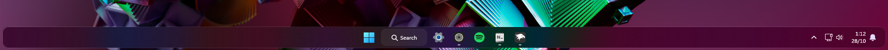
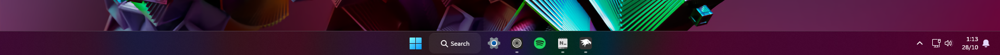
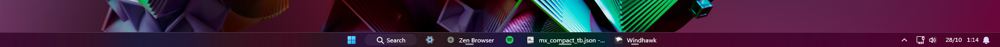
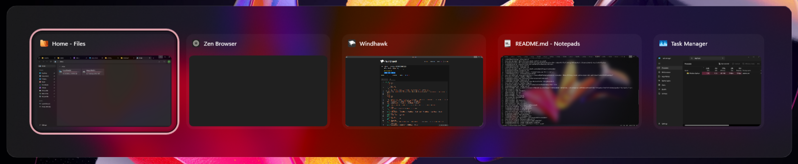
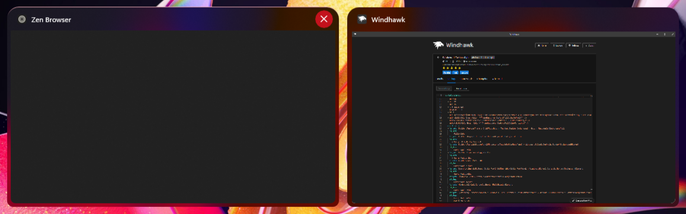
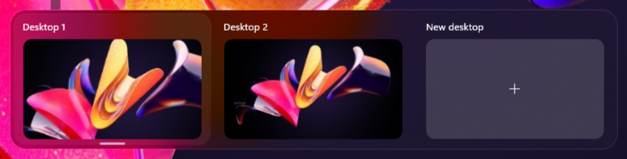
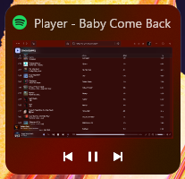

# Luminosity theme for Windows 11 Taskbar Styler

**Author**: [mendes.image](https://github.com/mendesimage)



## Intro
**Luminosity** is based on native Acrylic, using the maximum **TintLuminosityOpacity** value as its backdrop.

It's meant to be used with **Mica** or **MicaAlt** backdrops, with or without the **Translucent Windows** mod.

---

## Options

### Dock


- Docks are cool.

### Classic



- Meant to cause minimal disruption for users who prefer the classic Taskbar placement.

### Compact



- Meant to be used with **Taskbar Labels for Windows 11**, using the **Centered Running Indicator** style, and **Taskbar Clock Customization**. Otherwise, you will experience visual issues.

### Mods Guide

To apply the same settings as mine, follow these steps:

* Open the **Taskbar Labels for Windows 11** and **Taskbar Clock Customization** mods in Windhawk.
* Go to the "Settings" tab and select "Textual mode".
* Copy the content below to the text box and click "Save settings".

**Taskbar Labels for Windows 11**
<details>
<summary>Click to expand mod settings</summary>

```yaml
mode: labelsWithoutCombining
taskbarItemWidth: 0
runningIndicatorStyle: centerDynamic
progressIndicatorStyle: centerDynamic
excludedPrograms:
  - excluded1.exe
minimumTaskbarItemWidth: 50
maximumTaskbarItemWidth: 176
fontSize: 12
fontFamily: ''
textTrimming: characterEllipsis
leftAndRightPaddingSize: 8
spaceBetweenIconAndLabel: 8
runningIndicatorHeight: 0
runningIndicatorVerticalOffset: 0
alwaysShowThumbnailLabels: 0
labelForSingleItem: '%name%'
labelForMultipleItems: '[%amount%] %name%'
```
</details>

**Taskbar Clock Customization**
<details>
<summary>Click to expand mod settings</summary>

```yaml
ShowSeconds: 1
TimeFormat: ''
DateFormat: ''
WeekdayFormat: dddd
WeekdayFormatCustom: Sun, Mon, Tue, Wed, Thu, Fri, Sat
TopLine: '%date%   %time%'
BottomLine: ''
MiddleLine: '%weekday%'
TooltipLine: ''
TooltipLineMode: append
Width: 180
Height: 60
MaxWidth: 0
TextSpacing: 0
DataCollection:
  NetworkMetricsFormat: mbs
  NetworkMetricsFixedDecimals: -1
  PercentageFormat: spacePaddingAndSymbol
  UpdateInterval: 1
  NetworkAdapterName: ''
  GpuAdapterName: ''
MediaPlayer:
  IgnoredPlayers:
    - ''
  MaxLength: 28
  NoMediaText: No media
  RemoveBrackets: 0
WebContentWeatherLocation: ''
WebContentWeatherFormat: '%c 🌡️%t 🌬️%w'
WebContentWeatherUnits: autoDetect
WebContentsItems:
  - Url: https://rss.nytimes.com/services/xml/rss/nyt/World.xml
    BlockStart: <item>
    Start: <title>
    End: </title>
    ContentMode: xmlHtml
    SearchReplace:
      - Search: ''
        Replace: ''
    MaxLength: 28
WebContentsUpdateInterval: 10
TimeZones:
  - Eastern Standard Time
TimeStyle:
  Hidden: 0
  TextColor: ''
  TextAlignment: ''
  FontSize: 0
  FontFamily: ''
  FontWeight: ''
  FontStyle: ''
  FontStretch: ''
  CharacterSpacing: 0
DateStyle:
  Hidden: 1
  TextColor: ''
  TextAlignment: ''
  FontSize: 0
  FontFamily: ''
  FontWeight: ''
  FontStyle: ''
  FontStretch: ''
  CharacterSpacing: 0
oldTaskbarOnWin11: 0
DataCollectionUpdateInterval: 1
```
</details>

---

## General Information

The theme changes the following elements:

- Taskbar Frame
- Taskbar icon borders
- Taskbar icon sizes (compact version)
- Search icon with label
- Search box
- Taskbar Overflow Flyout
- System Tray
    - Chevron icon border
    - Software icon border
    - Microphone icon border
    - Spacing between element groups
    - Tray Overflow Flyout
- Volume bar
- Window Preview Flyout
- Alt+Tab
- Task View
- Snap Bar and Picker
- Context menus (with animations)
- Tooltips
- Removed drop shadows

<details>
<summary>Screenshots (Click to expand)</summary>

  


  
  
  
  


  


  

</details>


## Guides

### Custom Dock Width

The dock's width changes depending on your **screen resolution** using **horizontal margins**. If you want a custom width, follow this guide.

<details>
<summary>Click to expand guide</summary>

Locate and edit these `styleConstants` values:

  - DockMargin
  - DockMarginFix

The examples are for a **full length dock** (corner to corner).

## 1. Main taskbar width

`DockMargin=250`

This controls the main dock width.

- Smaller value = wider dock
- Larger value = narrower dock

Example: `DockMargin=5`

---

## 2. Background alignment fix

`DockMarginFix=500`

This value must always equal: `DockMargin × 2`

Example:

If: `DockMargin=5`

Then: `DockMarginFix=10`
</details>
 
---

### Left Taskbar Alignment Fix

<details>
<summary>Click to expand guide</summary>

When using **Left Taskbar Alignment** with Widget, remove the **minus sign** (`-`) from `WidgetGap=-`.

Like this: `WidgetGap=`

**Note:** `WidgetGap` if off by default on the Classic variant.
</details>

---

### Taskbar height and icon size Compatibility

<details>
<summary>Click to expand guide</summary>

You can edit the constant `Height=58`'s value, but doing so requires manually adjusting `DockTrayMarginUp` and `DockTrayMarginDown`.

Removing the last target allows external mods to change the height, though the manual adjustments listed above are still required.

```yaml
  - target: Taskbar.TaskbarFrame
    styles:
      - Height=$Height
```

</details>

---

### Custom Menu Animation Settings

Follow this guide to customize the animation behavior.

<details>
<summary>Click to expand guide</summary>

To customize the animations, look for this style constant 
```
AnimationSettings=IsStaggeringEnabled="True" FromHorizontalOffset="-50" FromVerticalOffset="50"
```

- For all items to display immediately, set `IsStaggeringEnabled=` from `"True"` to `"False"`.

- `FromHorizontalOffset` and `FromVerticalOffset` are the directions where the items come from.
  - Horizontal **Positive** values is **Right**, **Negative** is **Left**.
  - Vertical **Positive** values is **Down**, **Negative** is **Up**.
</details>

---

## Known Issues

I didn't know how to fix these. I couldn't find the correct target names, or I'm not sure if they can even be changed/fixed.

- **Left Taskbar Alignment (Dock):** **Left Taskbar Alignment** is not compatible by default. Refer to the [Left Taskbar Alignment Fix Guide](https://github.com/ramensoftware/windows-11-taskbar-styling-guide/tree/main/Themes/Luminosity/README.md#left-taskbar-alignment-fix).
- **Taskbar height and icon size Mod (Dock):** `Taskbar height and icon size` is not compatible, but you can edit manually. Refer to [Taskbar height and icon size Compatibility Guide](https://github.com/ramensoftware/windows-11-taskbar-styling-guide/tree/main/Themes/Luminosity/README.md#taskbar-height-and-icon-size-compatibility).
- **Icon Hitboxes (Dock):** The Taskbar's rounded corners slightly limit the icon hitbox on the **top and bottom**, which makes it **impossible to minimize windows by clicking in those areas**.
- **SearchBox (Dock/Classic):** Has **mismatched look and position** when typing.
- **SearchBox (Compact):** Has incorrect styling and positioning in the Compact version.
- **Widget/Weather (Compact):** The bottom text line has incorrect placement (renders off-screen).

---

## Theme selection

The theme is integrated into the mod and can be selected directly from the mod's
settings:

* Open the Windows 11 Taskbar Styler mod in Windhawk.
* Go to the "Settings" tab.
* Select the theme and save the settings.

## Manual installation

The theme styles can also be imported manually. To do that, follow these steps:

* Open the Windows 11 Taskbar Styler mod in Windhawk.
* Go to the "Settings" tab and select "Textual mode".
* Copy the content below to the text box and click "Save settings".

---

### Dock

<details>
<summary>Content to import (click to expand)</summary>

```yaml
styleConstants:
  - DockMargin=250
  - DockMarginFix=500
  - Height=58
  - DockTrayMarginUp=1
  - DockTrayMarginDown=1
  - WidgetGap=-
  - AccentColor=<SolidColorBrush Color="{ThemeResource SystemAccentColorLight2}" Opacity="1.0" />
  - AnimationSettings=IsStaggeringEnabled="True" FromHorizontalOffset="-50" FromVerticalOffset="50"
  - mbg=<WindhawkBlur BlurAmount="30" TintColor="{ThemeResource CardStrokeColorDefaultSolid}" TintOpacity="0.0" TintLuminosityOpacity="1.0" TintSaturation="1.0" NoiseDensity="1.0" NoiseOpacity="0.1" />
  - bcr=10
  - wcr=20
  - mcr=15
  - t=Transparent
  - bb=#20FFFFFF
  - bt=1
  - nbb=<LinearGradientBrush x:Key="ShellTaskbarItemGradientStrokeColorSecondaryBrush" MappingMode="Absolute" StartPoint="0,0" EndPoint="0,3"><LinearGradientBrush.GradientStops><GradientStop Offset="0.33" Color="#1AFFFFFF" /><GradientStop Offset="1" Color="#0FFFFFFF" /></LinearGradientBrush.GradientStops></LinearGradientBrush>
  - nbt=<SolidColorBrush Color="{ThemeResource ControlFillColorDefault}" />
  - nbth=<SolidColorBrush Color="{ThemeResource ControlFillColorSecondary}" />
  - nbtp=<SolidColorBrush Color="{ThemeResource ControlFillColorTertiary}" />
controlStyles:
  - target: Taskbar.TaskbarFrame > Grid#RootGrid > Taskbar.TaskbarBackground > Grid > Rectangle#BackgroundFill
    styles:
      - Fill:=$mbg
  - target: Taskbar.AugmentedEntryPointButton#AugmentedEntryPointButton
    styles:
      - Margin=0,0,$WidgetGap57,0
  - target: Taskbar.TaskListButtonPanel#ExperienceToggleButtonRootPanel > Windows.UI.Xaml.Controls.Border#BackgroundElement
    styles:
      - CornerRadius=$bcr
  - target: Taskbar.ExperienceToggleButton
    styles:
      - CornerRadius=$bcr
  - target: Taskbar.TaskListButton
    styles:
      - CornerRadius=$bcr
  - target: SearchUx.SearchUI.SearchButtonRootGrid#SearchBoxButtonRootPanel > Windows.UI.Xaml.Controls.Border#BackgroundElement
    styles:
      - CornerRadius=$bcr
  - target: Windows.UI.Xaml.Controls.Border#SearchPillBackgroundElement
    styles:
      - CornerRadius=$bcr
  - target: Windows.UI.Xaml.Controls.Border#MultiWindowElement
    styles:
      - CornerRadius=$bcr
  - target: SystemTray.ChevronIconView > Windows.UI.Xaml.Controls.Grid#ContainerGrid > Windows.UI.Xaml.Controls.Border#BackgroundBorder
    styles:
      - CornerRadius=$bcr
      - Margin=0,4,2,4
  - target: SystemTray.NotifyIconView > Windows.UI.Xaml.Controls.Grid#ContainerGrid > Windows.UI.Xaml.Controls.Border#BackgroundBorder
    styles:
      - CornerRadius=$bcr
      - Margin=2,4,2,4
  - target: SystemTray.IconView#SystemTrayIcon > Windows.UI.Xaml.Controls.Grid#ContainerGrid > Windows.UI.Xaml.Controls.Border#BackgroundBorder
    styles:
      - CornerRadius=$bcr
      - Margin=2,4,2,4
  - target: SystemTray.OmniButton#ControlCenterButton > Windows.UI.Xaml.Controls.Grid > Windows.UI.Xaml.Controls.Border#BackgroundBorder
    styles:
      - CornerRadius=$bcr
      - Margin=2,4,2,4
  - target: SystemTray.OmniButton#NotificationCenterButton > Windows.UI.Xaml.Controls.Grid > Windows.UI.Xaml.Controls.Border#BackgroundBorder
    styles:
      - CornerRadius=$bcr
      - Margin=2,4,2,4
  - target: Border#OverflowFlyoutBackgroundBorder
    styles:
      - Background:=$mbg
      - CornerRadius:=$wcr
      - BorderThickness=$bt
      - BorderBrush=$bb
      - Shadow:=
  - target: Taskbar.OverflowToggleButton#OverflowButton > Taskbar.TaskListButtonPanel#OverflowToggleButtonRootPanel > Windows.UI.Xaml.Controls.Border#BackgroundElement
    styles:
      - CornerRadius=$bcr
  - target: Windows.UI.Xaml.Controls.Grid#ConfirmatorMainGrid
    styles:
      - Background:=$mbg
      - CornerRadius=$wcr
      - BorderThickness=$bt
      - BorderBrush=$bb
      - Shadow:=
  - target: Windows.UI.Xaml.Shapes.Rectangle#HorizontalTrackRect
    styles:
      - Fill:=#10FFFFFF
  - target: WindowsInternal.ComposableShell.Experiences.TextInput.Common.InputSwitcher > ContentControl > ContentPresenter > Grid
    styles:
      - Background:=$mbg
      - CornerRadius=$wcr
      - BorderThickness=$bt
      - BorderBrush=$bb
      - Shadow:=
  - target: WindowsInternal.ComposableShell.Experiences.TextInput.Common.InputSwitcher > ContentControl > ContentPresenter > Grid > Grid
    styles:
      - Background:=$t
  - target: Taskbar.TaskbarBackground#HoverFlyoutBackgroundControl > Grid > Rectangle#BackgroundFill
    styles:
      - Fill:=$t
  - target: Windows.UI.Xaml.Controls.Grid#HoverFlyoutGrid > Windows.UI.Xaml.Controls.Border#HoverFlyoutBackground
    styles:
      - Background:=$mbg
      - CornerRadius=$mcr
      - BorderThickness=$bt
      - BorderBrush=$bb
      - Shadow:=
  - target: Taskbar.TaskItemThumbnailView > Grid@CommonStates > Border#BackgroundBorder
    styles:
      - Background=$t
      - CornerRadius=$mcr
      - BorderThickness@Normal=0
      - BorderThickness@PointerOver=0.05,0,0.05,1
      - BorderBrush@Normal=$t
      - BorderBrush@PointerOver:=$AccentColor
  - target: Taskbar.TaskItemThumbnailView > Grid > Button#CloseButton
    styles:
      - CornerRadius=$mcr
  - target: Taskbar.ThumbBarButton#ThumbBarButton > Windows.UI.Xaml.Controls.ContentPresenter#BorderElement@CommonStates
    styles:
      - CornerRadius=16
      - Margin=-1.5
      - Background@Disabled:=$t
      - Background@Normal:=$t
      - Background@PointerOver:=$nbth
      - Background@Pressed:=$nbtp
      - BorderThickness=2
      - BorderBrush@Disabled:=$t
      - BorderBrush@Normal:=$t
      - BorderBrush@PointerOver:=$nbb
      - BorderBrush@Pressed:=$nbb
      - BackgroundSizing=InnerBorderEdge
      - BackgroundTransition:=<BrushTransition Duration="0:0:0.200" />
  - target: Windows.UI.Xaml.Controls.Grid#ModalRootGrid > Windows.UI.Xaml.Controls.Border#BackgroundElement
    styles:
      - Background=$t
      - CornerRadius=$wcr
      - BorderThickness=$bt
      - BorderBrush=$bb
      - Shadow:=
  - target: Windows.UI.Xaml.Controls.Grid#ModalRootGrid > Windows.UI.Xaml.Controls.Border#BackgroundElement > WindowsInternal.ComposableShell.Experiences.Switcher.SwitchItemList
    styles:
      - Background:=$mbg
  - target: WindowsInternal.ComposableShell.Experiences.Switcher.DynamicFlowPanel > WindowsInternal.ComposableShell.Experiences.Switcher.SwitchItemListViewItem > Windows.UI.Xaml.Controls.Grid#Root@CommonStates > Windows.UI.Xaml.Controls.Border#BackgroundBorder
    styles:
      - Background:=#09FFFFFF
      - CornerRadius=$mcr
      - BorderThickness=0.05,1,0.05,0
      - BorderBrush@Normal=$t
      - BorderBrush@PointerOver:=$AccentColor
  - target: WindowsInternal.ComposableShell.Experiences.Switcher.SwitchItemControl > Grid#Root > WindowsInternal.ComposableShell.Experiences.Switcher.SwitchItemThumbnailButton#ThumbnailHost > Windows.UI.Xaml.Controls.Grid#RootGrid
    styles:
      - CornerRadius=$bcr
      - Margin=5
  - target: Windows.UI.Xaml.Controls.Border#BackgroundDimmingLayer
    styles:
      - Background:=$t
  - target: WindowsInternal.ComposableShell.Experiences.Switcher.VirtualDesktopBarElement > Windows.UI.Xaml.Controls.Grid#GridElement > Windows.UI.Xaml.Controls.Border#VirtualDesktopSwitcherBackground
    styles:
      - CornerRadius=$wcr
      - BorderThickness=$bt
      - BorderBrush=$bb
      - Margin=-2,1,-1,2
  - target: WindowsInternal.ComposableShell.Experiences.Switcher.DynamicFlowPanel#DFCPanel > WindowsInternal.ComposableShell.Experiences.Switcher.SwitchItemListViewItem > Windows.UI.Xaml.Controls.Grid#Root@CommonStates > Windows.UI.Xaml.Controls.Border#BackgroundBorder
    styles:
      - Background:=$mbg
      - CornerRadius=$wcr,$wcr,$bcr,$bcr
      - Margin:=-5,0,-5,-5
      - BorderThickness=0.05,1,0.05,0
      - BorderBrush@Normal=$t
      - BorderBrush@PointerOver:=$AccentColor
  - target: WindowsInternal.ComposableShell.Experiences.Switcher.SwitchItemElement > Windows.UI.Xaml.Controls.Grid#RootGrid > Windows.UI.Xaml.Controls.Grid#TitleGrid > Windows.UI.Xaml.Controls.Border#BackgroundBorder
    styles:
      - Background:=$t
  - target: WindowsInternal.ComposableShell.Experiences.Switcher.SwitchItemElement > Windows.UI.Xaml.Controls.Grid#RootGrid > Windows.UI.Xaml.Controls.Grid#TitleGrid > Image#IconImage
    styles:
      - RenderTransform:=<TranslateTransform X="0" Y="1" />
  - target: WindowsInternal.ComposableShell.Experiences.Switcher.SwitchItemElement > Windows.UI.Xaml.Controls.Grid#RootGrid > Windows.UI.Xaml.Controls.Grid#TitleGrid > TextBlock#DisplayName
    styles:
      - RenderTransform:=<TranslateTransform X="0" Y="1" />
  - target: Windows.UI.Xaml.Controls.Button#SwitchItemElementCloseButton > ContentPresenter#ContentPresenter
    styles:
      - CornerRadius=$mcr
      - Margin=5
  - target: Windows.UI.Xaml.Controls.Button#SwitchItemElementCloseButton > ContentPresenter#ContentPresenter > TextBlock
    styles:
      - RenderTransform:=<TranslateTransform X="-0.8" Y="-0.6" />
  - target: WindowsInternal.ComposableShell.Experiences.Switcher.SwitchItemElement > Grid#RootGrid > WindowsInternal.ComposableShell.Experiences.Switcher.SwitchItemThumbnailButton#ThumbnailHost > Grid#RootGrid
    styles:
      - CornerRadius=0
  - target: WindowsInternal.ComposableShell.Experiences.Switcher.VirtualDesktopBarElement#VirtualDesktopBar > Grid > Border
    styles:
      - Background:=$mbg
      - CornerRadius=$wcr
      - BorderThickness=$bt
      - BorderBrush=$bb
      - Margin=-1,2,0,0
  - target: WindowsInternal.ComposableShell.Experiences.Switcher.VirtualDesktopBarElement#VirtualDesktopBar
    styles:
      - Width=Auto
      - HorizontalAlignment=1
  - target: WindowsInternal.ComposableShell.Experiences.Switcher.VirtualDesktopBarElement > Grid > Border
    styles:
      - Background:=$mbg
      - Shadow:=
  - target: WindowsInternal.ComposableShell.Experiences.Switcher.VirtualDesktopElementThemed > Windows.UI.Xaml.Controls.Grid#MainGrid > Windows.UI.Xaml.Controls.Border#MainBorder
    styles:
      - CornerRadius=$mcr
  - target: WindowsInternal.ComposableShell.Experiences.Switcher.VirtualDesktopElementThemed > Windows.UI.Xaml.Controls.Grid#MainGrid > Windows.UI.Xaml.Controls.Border#BorderHighlight
    styles:
      - CornerRadius=$mcr
  - target: WindowsInternal.ComposableShell.Experiences.Switcher.NewVirtualDesktopElementThemed#NewVirtualDesktopButtonThemed > Windows.UI.Xaml.Controls.Grid#MainGrid
    styles:
      - CornerRadius=$mcr
      - BorderThickness=$bt
      - Margin=2
  - target: WindowsInternal.ComposableShell.Experiences.Switcher.NewVirtualDesktopElementThemed#NewVirtualDesktopButtonThemed > Windows.UI.Xaml.Controls.Grid#MainGrid > Windows.UI.Xaml.Controls.Border#MainBorder
    styles:
      - CornerRadius=$mcr
  - target: WindowsInternal.ComposableShell.Experiences.Switcher.NewVirtualDesktopElementThemed#NewVirtualDesktopButtonThemed > Windows.UI.Xaml.Controls.Grid#MainGrid > Windows.UI.Xaml.Controls.Border#BorderHighlight
    styles:
      - CornerRadius=$mcr
  - target: WindowsInternal.ComposableShell.Experiences.Switcher.VirtualDesktopThumbnailButton#ThumbnailButtonElement
    styles:
      - CornerRadius=$bcr
  - target: Windows.UI.Xaml.Controls.Button#VirtualDesktopElementCloseButton
    styles:
      - CornerRadius=$bcr
  - target: Windows.UI.Xaml.Controls.Border#SnapBarBorder
    styles:
      - Background:=$mbg
      - CornerRadius=$mcr
      - BorderThickness=$bt
      - BorderBrush=$bb
      - Shadow:=
  - target: Windows.UI.Xaml.Controls.Border#SnapPickerBorder
    styles:
      - Background:=$mbg
      - CornerRadius=$mcr
      - BorderThickness=$bt
      - BorderBrush=$bb
  - target: Windows.UI.Xaml.Controls.FlyoutPresenter > Border
    styles:
      - Shadow:=
  - target: MenuFlyoutPresenter
    styles:
      - CornerRadius=$mcr
      - Shadow:=
  - target: MenuFlyoutPresenter > Border
    styles:
      - Background:=$mbg
      - CornerRadius=$mcr
      - BorderThickness=$bt
      - BorderBrush=$bb
  - target: Windows.UI.Xaml.Controls.MenuFlyoutItem
    styles:
      - CornerRadius=$bcr
  - target: Windows.UI.Xaml.Controls.MenuFlyoutSubItem
    styles:
      - CornerRadius=$bcr
  - target: Windows.UI.Xaml.Controls.ToolTip > Windows.UI.Xaml.Controls.ContentPresenter#LayoutRoot
    styles:
      - Background:=$mbg
      - CornerRadius=$mcr
      - BorderThickness=$bt
      - BorderBrush=$bb
      - Shadow:=
  - target: ScrollViewer#MenuFlyoutPresenterScrollViewer > Border > Grid > ScrollContentPresenter > ItemsPresenter > StackPanel
    styles:
      - ChildrenTransitions:=<TransitionCollection><EntranceThemeTransition $AnimationSettings /></TransitionCollection>
  - target: Grid#LayoutRoot
    styles:
      - BackgroundTransition:=<BrushTransition Duration="0:0:0.100" />
  - target: Border#BackgroundBorder
    styles:
      - BackgroundTransition:=<BrushTransition Duration="0:0:0.100" />
  - target: Taskbar.TaskbarFrame > Grid#RootGrid > Taskbar.TaskbarBackground > Grid > Rectangle#BackgroundFill
    styles:
      - Visibility=Collapsed
  - target: Taskbar.TaskbarFrame
    styles:
      - Margin=$DockMargin,0,$DockMargin,0
  - target: Taskbar.TaskbarFrame > Grid#RootGrid
    styles:
      - Background:=$mbg
      - BorderThickness=$bt
      - BorderBrush:=$bb
      - CornerRadius=$mcr
      - Margin=0,5,$DockMarginFix,5
  - target: Taskbar.TaskbarBackground#BackgroundControl > Windows.UI.Xaml.Controls.Grid > Windows.UI.Xaml.Shapes.Rectangle#BackgroundStroke
    styles:
      - Visibility=Collapsed
  - target: Taskbar.TaskListButtonPanel#ExperienceToggleButtonRootPanel > Windows.UI.Xaml.Controls.Grid#AugmentedEntryPointContentGrid
    styles:
      - RenderTransform:=<TranslateTransform X="0" Y="-1" />
  - target: Windows.UI.Xaml.Controls.Border#LargeTicker1
    styles:
      - Margin=0,0,0,-4
  - target: Grid#SystemTrayFrameGrid
    styles:
      - Margin=-$DockMargin,$DockTrayMarginUp,$DockMargin,$DockTrayMarginDown
      - HorizontalAlignment=Right
  - target: Taskbar.TaskbarFrame
    styles:
      - Height=$Height
```
</details>

---

### Classic

<details>
<summary>Content to import (click to expand)</summary>

```yaml
styleConstants:
  - WidgetGap=
  - AccentColor=<SolidColorBrush Color="{ThemeResource SystemAccentColorLight2}" Opacity="1.0" />
  - AnimationSettings=IsStaggeringEnabled="True" FromHorizontalOffset="-50" FromVerticalOffset="50"
  - mbg=<WindhawkBlur BlurAmount="30" TintColor="{ThemeResource CardStrokeColorDefaultSolid}" TintOpacity="0.0" TintLuminosityOpacity="1.0" TintSaturation="1.0" NoiseDensity="1.0" NoiseOpacity="0.1" />
  - bcr=10
  - wcr=20
  - mcr=15
  - t=Transparent
  - bb=#20FFFFFF
  - bt=1
  - nbb=<LinearGradientBrush x:Key="ShellTaskbarItemGradientStrokeColorSecondaryBrush" MappingMode="Absolute" StartPoint="0,0" EndPoint="0,3"><LinearGradientBrush.GradientStops><GradientStop Offset="0.33" Color="#1AFFFFFF" /><GradientStop Offset="1" Color="#0FFFFFFF" /></LinearGradientBrush.GradientStops></LinearGradientBrush>
  - nbt=<SolidColorBrush Color="{ThemeResource ControlFillColorDefault}" />
  - nbth=<SolidColorBrush Color="{ThemeResource ControlFillColorSecondary}" />
  - nbtp=<SolidColorBrush Color="{ThemeResource ControlFillColorTertiary}" />
controlStyles:
  - target: Taskbar.TaskbarFrame > Grid#RootGrid > Taskbar.TaskbarBackground > Grid > Rectangle#BackgroundFill
    styles:
      - Fill:=$mbg
  - target: Taskbar.AugmentedEntryPointButton#AugmentedEntryPointButton
    styles:
      - Margin=0,0,$WidgetGap57,0
  - target: Taskbar.TaskListButtonPanel#ExperienceToggleButtonRootPanel > Windows.UI.Xaml.Controls.Border#BackgroundElement
    styles:
      - CornerRadius=$bcr
  - target: Taskbar.ExperienceToggleButton
    styles:
      - CornerRadius=$bcr
  - target: Taskbar.TaskListButton
    styles:
      - CornerRadius=$bcr
  - target: SearchUx.SearchUI.SearchButtonRootGrid#SearchBoxButtonRootPanel > Windows.UI.Xaml.Controls.Border#BackgroundElement
    styles:
      - CornerRadius=$bcr
  - target: Windows.UI.Xaml.Controls.Border#SearchPillBackgroundElement
    styles:
      - CornerRadius=$bcr
  - target: Windows.UI.Xaml.Controls.Border#MultiWindowElement
    styles:
      - CornerRadius=$bcr
  - target: SystemTray.ChevronIconView > Windows.UI.Xaml.Controls.Grid#ContainerGrid > Windows.UI.Xaml.Controls.Border#BackgroundBorder
    styles:
      - CornerRadius=$bcr
      - Margin=0,4,2,4
  - target: SystemTray.NotifyIconView > Windows.UI.Xaml.Controls.Grid#ContainerGrid > Windows.UI.Xaml.Controls.Border#BackgroundBorder
    styles:
      - CornerRadius=$bcr
      - Margin=2,4,2,4
  - target: SystemTray.IconView#SystemTrayIcon > Windows.UI.Xaml.Controls.Grid#ContainerGrid > Windows.UI.Xaml.Controls.Border#BackgroundBorder
    styles:
      - CornerRadius=$bcr
      - Margin=2,4,2,4
  - target: SystemTray.OmniButton#ControlCenterButton > Windows.UI.Xaml.Controls.Grid > Windows.UI.Xaml.Controls.Border#BackgroundBorder
    styles:
      - CornerRadius=$bcr
      - Margin=2,4,2,4
  - target: SystemTray.OmniButton#NotificationCenterButton > Windows.UI.Xaml.Controls.Grid > Windows.UI.Xaml.Controls.Border#BackgroundBorder
    styles:
      - CornerRadius=$bcr
      - Margin=2,4,2,4
  - target: Border#OverflowFlyoutBackgroundBorder
    styles:
      - Background:=$mbg
      - CornerRadius:=$wcr
      - BorderThickness=$bt
      - BorderBrush=$bb
      - Shadow:=
  - target: Taskbar.OverflowToggleButton#OverflowButton > Taskbar.TaskListButtonPanel#OverflowToggleButtonRootPanel > Windows.UI.Xaml.Controls.Border#BackgroundElement
    styles:
      - CornerRadius=$bcr
  - target: Windows.UI.Xaml.Controls.Grid#ConfirmatorMainGrid
    styles:
      - Background:=$mbg
      - CornerRadius=$wcr
      - BorderThickness=$bt
      - BorderBrush=$bb
      - Shadow:=
  - target: Windows.UI.Xaml.Shapes.Rectangle#HorizontalTrackRect
    styles:
      - Fill:=#10FFFFFF
  - target: WindowsInternal.ComposableShell.Experiences.TextInput.Common.InputSwitcher > ContentControl > ContentPresenter > Grid
    styles:
      - Background:=$mbg
      - CornerRadius=$wcr
      - BorderThickness=$bt
      - BorderBrush=$bb
      - Shadow:=
  - target: WindowsInternal.ComposableShell.Experiences.TextInput.Common.InputSwitcher > ContentControl > ContentPresenter > Grid > Grid
    styles:
      - Background:=$t
  - target: Taskbar.TaskbarBackground#HoverFlyoutBackgroundControl > Grid > Rectangle#BackgroundFill
    styles:
      - Fill:=$t
  - target: Windows.UI.Xaml.Controls.Grid#HoverFlyoutGrid > Windows.UI.Xaml.Controls.Border#HoverFlyoutBackground
    styles:
      - Background:=$mbg
      - CornerRadius=$mcr
      - BorderThickness=$bt
      - BorderBrush=$bb
      - Shadow:=
  - target: Taskbar.TaskItemThumbnailView > Grid@CommonStates > Border#BackgroundBorder
    styles:
      - Background=$t
      - CornerRadius=$mcr
      - BorderThickness@Normal=0
      - BorderThickness@PointerOver=0.05,0,0.05,1
      - BorderBrush@Normal=$t
      - BorderBrush@PointerOver:=$AccentColor
  - target: Taskbar.TaskItemThumbnailView > Grid > Button#CloseButton
    styles:
      - CornerRadius=$mcr
  - target: Taskbar.ThumbBarButton#ThumbBarButton > Windows.UI.Xaml.Controls.ContentPresenter#BorderElement@CommonStates
    styles:
      - CornerRadius=16
      - Margin=-1.5
      - Background@Disabled:=$t
      - Background@Normal:=$t
      - Background@PointerOver:=$nbth
      - Background@Pressed:=$nbtp
      - BorderThickness=2
      - BorderBrush@Disabled:=$t
      - BorderBrush@Normal:=$t
      - BorderBrush@PointerOver:=$nbb
      - BorderBrush@Pressed:=$nbb
      - BackgroundSizing=InnerBorderEdge
      - BackgroundTransition:=<BrushTransition Duration="0:0:0.200" />
  - target: Windows.UI.Xaml.Controls.Grid#ModalRootGrid > Windows.UI.Xaml.Controls.Border#BackgroundElement
    styles:
      - Background=$t
      - CornerRadius=$wcr
      - BorderThickness=$bt
      - BorderBrush=$bb
      - Shadow:=
  - target: Windows.UI.Xaml.Controls.Grid#ModalRootGrid > Windows.UI.Xaml.Controls.Border#BackgroundElement > WindowsInternal.ComposableShell.Experiences.Switcher.SwitchItemList
    styles:
      - Background:=$mbg
  - target: WindowsInternal.ComposableShell.Experiences.Switcher.DynamicFlowPanel > WindowsInternal.ComposableShell.Experiences.Switcher.SwitchItemListViewItem > Windows.UI.Xaml.Controls.Grid#Root@CommonStates > Windows.UI.Xaml.Controls.Border#BackgroundBorder
    styles:
      - Background:=#09FFFFFF
      - CornerRadius=$mcr
      - BorderThickness=0.05,1,0.05,0
      - BorderBrush@Normal=$t
      - BorderBrush@PointerOver:=$AccentColor
  - target: WindowsInternal.ComposableShell.Experiences.Switcher.SwitchItemControl > Grid#Root > WindowsInternal.ComposableShell.Experiences.Switcher.SwitchItemThumbnailButton#ThumbnailHost > Windows.UI.Xaml.Controls.Grid#RootGrid
    styles:
      - CornerRadius=$bcr
      - Margin=5
  - target: Windows.UI.Xaml.Controls.Border#BackgroundDimmingLayer
    styles:
      - Background:=$t
  - target: WindowsInternal.ComposableShell.Experiences.Switcher.VirtualDesktopBarElement > Windows.UI.Xaml.Controls.Grid#GridElement > Windows.UI.Xaml.Controls.Border#VirtualDesktopSwitcherBackground
    styles:
      - CornerRadius=$wcr
      - BorderThickness=$bt
      - BorderBrush=$bb
      - Margin=-2,1,-1,2
  - target: WindowsInternal.ComposableShell.Experiences.Switcher.DynamicFlowPanel#DFCPanel > WindowsInternal.ComposableShell.Experiences.Switcher.SwitchItemListViewItem > Windows.UI.Xaml.Controls.Grid#Root@CommonStates > Windows.UI.Xaml.Controls.Border#BackgroundBorder
    styles:
      - Background:=$mbg
      - CornerRadius=$wcr,$wcr,$bcr,$bcr
      - Margin:=-5,0,-5,-5
      - BorderThickness=0.05,1,0.05,0
      - BorderBrush@Normal=$t
      - BorderBrush@PointerOver:=$AccentColor
  - target: WindowsInternal.ComposableShell.Experiences.Switcher.SwitchItemElement > Windows.UI.Xaml.Controls.Grid#RootGrid > Windows.UI.Xaml.Controls.Grid#TitleGrid > Windows.UI.Xaml.Controls.Border#BackgroundBorder
    styles:
      - Background:=$t
  - target: WindowsInternal.ComposableShell.Experiences.Switcher.SwitchItemElement > Windows.UI.Xaml.Controls.Grid#RootGrid > Windows.UI.Xaml.Controls.Grid#TitleGrid > Image#IconImage
    styles:
      - RenderTransform:=<TranslateTransform X="0" Y="1" />
  - target: WindowsInternal.ComposableShell.Experiences.Switcher.SwitchItemElement > Windows.UI.Xaml.Controls.Grid#RootGrid > Windows.UI.Xaml.Controls.Grid#TitleGrid > TextBlock#DisplayName
    styles:
      - RenderTransform:=<TranslateTransform X="0" Y="1" />
  - target: Windows.UI.Xaml.Controls.Button#SwitchItemElementCloseButton > ContentPresenter#ContentPresenter
    styles:
      - CornerRadius=$mcr
      - Margin=5
  - target: Windows.UI.Xaml.Controls.Button#SwitchItemElementCloseButton > ContentPresenter#ContentPresenter > TextBlock
    styles:
      - RenderTransform:=<TranslateTransform X="-0.8" Y="-0.6" />
  - target: WindowsInternal.ComposableShell.Experiences.Switcher.SwitchItemElement > Grid#RootGrid > WindowsInternal.ComposableShell.Experiences.Switcher.SwitchItemThumbnailButton#ThumbnailHost > Grid#RootGrid
    styles:
      - CornerRadius=0
  - target: WindowsInternal.ComposableShell.Experiences.Switcher.VirtualDesktopBarElement#VirtualDesktopBar > Grid > Border
    styles:
      - Background:=$mbg
      - CornerRadius=$wcr
      - BorderThickness=$bt
      - BorderBrush=$bb
      - Margin=-1,2,0,0
  - target: WindowsInternal.ComposableShell.Experiences.Switcher.VirtualDesktopBarElement#VirtualDesktopBar
    styles:
      - Width=Auto
      - HorizontalAlignment=1
  - target: WindowsInternal.ComposableShell.Experiences.Switcher.VirtualDesktopBarElement > Grid > Border
    styles:
      - Background:=$mbg
      - Shadow:=
  - target: WindowsInternal.ComposableShell.Experiences.Switcher.VirtualDesktopElementThemed > Windows.UI.Xaml.Controls.Grid#MainGrid > Windows.UI.Xaml.Controls.Border#MainBorder
    styles:
      - CornerRadius=$mcr
  - target: WindowsInternal.ComposableShell.Experiences.Switcher.VirtualDesktopElementThemed > Windows.UI.Xaml.Controls.Grid#MainGrid > Windows.UI.Xaml.Controls.Border#BorderHighlight
    styles:
      - CornerRadius=$mcr
  - target: WindowsInternal.ComposableShell.Experiences.Switcher.NewVirtualDesktopElementThemed#NewVirtualDesktopButtonThemed > Windows.UI.Xaml.Controls.Grid#MainGrid
    styles:
      - CornerRadius=$mcr
      - BorderThickness=$bt
      - Margin=2
  - target: WindowsInternal.ComposableShell.Experiences.Switcher.NewVirtualDesktopElementThemed#NewVirtualDesktopButtonThemed > Windows.UI.Xaml.Controls.Grid#MainGrid > Windows.UI.Xaml.Controls.Border#MainBorder
    styles:
      - CornerRadius=$mcr
  - target: WindowsInternal.ComposableShell.Experiences.Switcher.NewVirtualDesktopElementThemed#NewVirtualDesktopButtonThemed > Windows.UI.Xaml.Controls.Grid#MainGrid > Windows.UI.Xaml.Controls.Border#BorderHighlight
    styles:
      - CornerRadius=$mcr
  - target: WindowsInternal.ComposableShell.Experiences.Switcher.VirtualDesktopThumbnailButton#ThumbnailButtonElement
    styles:
      - CornerRadius=$bcr
  - target: Windows.UI.Xaml.Controls.Button#VirtualDesktopElementCloseButton
    styles:
      - CornerRadius=$bcr
  - target: Windows.UI.Xaml.Controls.Border#SnapBarBorder
    styles:
      - Background:=$mbg
      - CornerRadius=$mcr
      - BorderThickness=$bt
      - BorderBrush=$bb
      - Shadow:=
  - target: Windows.UI.Xaml.Controls.Border#SnapPickerBorder
    styles:
      - Background:=$mbg
      - CornerRadius=$mcr
      - BorderThickness=$bt
      - BorderBrush=$bb
  - target: Windows.UI.Xaml.Controls.FlyoutPresenter > Border
    styles:
      - Shadow:=
  - target: MenuFlyoutPresenter
    styles:
      - CornerRadius=$mcr
      - Shadow:=
  - target: MenuFlyoutPresenter > Border
    styles:
      - Background:=$mbg
      - CornerRadius=$mcr
      - BorderThickness=$bt
      - BorderBrush=$bb
  - target: Windows.UI.Xaml.Controls.MenuFlyoutItem
    styles:
      - CornerRadius=$bcr
  - target: Windows.UI.Xaml.Controls.MenuFlyoutSubItem
    styles:
      - CornerRadius=$bcr
  - target: Windows.UI.Xaml.Controls.ToolTip > Windows.UI.Xaml.Controls.ContentPresenter#LayoutRoot
    styles:
      - Background:=$mbg
      - CornerRadius=$mcr
      - BorderThickness=$bt
      - BorderBrush=$bb
      - Shadow:=
  - target: ScrollViewer#MenuFlyoutPresenterScrollViewer > Border > Grid > ScrollContentPresenter > ItemsPresenter > StackPanel
    styles:
      - ChildrenTransitions:=<TransitionCollection><EntranceThemeTransition $AnimationSettings /></TransitionCollection>
  - target: Grid#LayoutRoot
    styles:
      - BackgroundTransition:=<BrushTransition Duration="0:0:0.100" />
  - target: Border#BackgroundBorder
    styles:
      - BackgroundTransition:=<BrushTransition Duration="0:0:0.100" />
```
</details>

---

### Compact

<details>
<summary>Content to import (click to expand)</summary>

```yaml
styleConstants:
  - WidgetGap=-
  - AccentColor=<SolidColorBrush Color="{ThemeResource SystemAccentColorLight2}" Opacity="1.0" />
  - AnimationSettings=IsStaggeringEnabled="True" FromHorizontalOffset="-50" FromVerticalOffset="50"
  - mbg=<WindhawkBlur BlurAmount="30" TintColor="{ThemeResource CardStrokeColorDefaultSolid}" TintOpacity="0.0" TintLuminosityOpacity="1.0" TintSaturation="1.0" NoiseDensity="1.0" NoiseOpacity="0.1" />
  - bcr=10
  - wcr=20
  - mcr=15
  - t=Transparent
  - bb=#20FFFFFF
  - bt=1
  - nbb=<LinearGradientBrush x:Key="ShellTaskbarItemGradientStrokeColorSecondaryBrush" MappingMode="Absolute" StartPoint="0,0" EndPoint="0,3"><LinearGradientBrush.GradientStops><GradientStop Offset="0.33" Color="#1AFFFFFF" /><GradientStop Offset="1" Color="#0FFFFFFF" /></LinearGradientBrush.GradientStops></LinearGradientBrush>
  - nbt=<SolidColorBrush Color="{ThemeResource ControlFillColorDefault}" />
  - nbth=<SolidColorBrush Color="{ThemeResource ControlFillColorSecondary}" />
  - nbtp=<SolidColorBrush Color="{ThemeResource ControlFillColorTertiary}" />
controlStyles:
  - target: Taskbar.TaskbarFrame > Grid#RootGrid > Taskbar.TaskbarBackground > Grid > Rectangle#BackgroundFill
    styles:
      - Fill:=$mbg
  - target: Taskbar.AugmentedEntryPointButton#AugmentedEntryPointButton
    styles:
      - Margin=0,0,$WidgetGap57,0
  - target: Taskbar.TaskListButtonPanel#ExperienceToggleButtonRootPanel > Windows.UI.Xaml.Controls.Border#BackgroundElement
    styles:
      - CornerRadius=$bcr
  - target: Taskbar.ExperienceToggleButton
    styles:
      - CornerRadius=$bcr
  - target: Taskbar.TaskListButton
    styles:
      - CornerRadius=$bcr
  - target: SearchUx.SearchUI.SearchButtonRootGrid#SearchBoxButtonRootPanel > Windows.UI.Xaml.Controls.Border#BackgroundElement
    styles:
      - CornerRadius=$bcr
  - target: Windows.UI.Xaml.Controls.Border#SearchPillBackgroundElement
    styles:
      - CornerRadius=$bcr
  - target: Windows.UI.Xaml.Controls.Border#MultiWindowElement
    styles:
      - CornerRadius=$bcr
  - target: SystemTray.ChevronIconView > Windows.UI.Xaml.Controls.Grid#ContainerGrid > Windows.UI.Xaml.Controls.Border#BackgroundBorder
    styles:
      - CornerRadius=$bcr
      - Margin=0,4,2,4
  - target: SystemTray.NotifyIconView > Windows.UI.Xaml.Controls.Grid#ContainerGrid > Windows.UI.Xaml.Controls.Border#BackgroundBorder
    styles:
      - CornerRadius=$bcr
      - Margin=2,4,2,4
  - target: SystemTray.IconView#SystemTrayIcon > Windows.UI.Xaml.Controls.Grid#ContainerGrid > Windows.UI.Xaml.Controls.Border#BackgroundBorder
    styles:
      - CornerRadius=$bcr
      - Margin=2,4,2,4
  - target: SystemTray.OmniButton#ControlCenterButton > Windows.UI.Xaml.Controls.Grid > Windows.UI.Xaml.Controls.Border#BackgroundBorder
    styles:
      - CornerRadius=$bcr
      - Margin=2,4,2,4
  - target: SystemTray.OmniButton#NotificationCenterButton > Windows.UI.Xaml.Controls.Grid > Windows.UI.Xaml.Controls.Border#BackgroundBorder
    styles:
      - CornerRadius=$bcr
      - Margin=2,4,2,4
  - target: Border#OverflowFlyoutBackgroundBorder
    styles:
      - Background:=$mbg
      - CornerRadius:=$wcr
      - BorderThickness=$bt
      - BorderBrush=$bb
      - Shadow:=
  - target: Taskbar.OverflowToggleButton#OverflowButton > Taskbar.TaskListButtonPanel#OverflowToggleButtonRootPanel > Windows.UI.Xaml.Controls.Border#BackgroundElement
    styles:
      - CornerRadius=$bcr
  - target: Windows.UI.Xaml.Controls.Grid#ConfirmatorMainGrid
    styles:
      - Background:=$mbg
      - CornerRadius=$wcr
      - BorderThickness=$bt
      - BorderBrush=$bb
      - Shadow:=
  - target: Windows.UI.Xaml.Shapes.Rectangle#HorizontalTrackRect
    styles:
      - Fill:=#10FFFFFF
  - target: WindowsInternal.ComposableShell.Experiences.TextInput.Common.InputSwitcher > ContentControl > ContentPresenter > Grid
    styles:
      - Background:=$mbg
      - CornerRadius=$wcr
      - BorderThickness=$bt
      - BorderBrush=$bb
      - Shadow:=
  - target: WindowsInternal.ComposableShell.Experiences.TextInput.Common.InputSwitcher > ContentControl > ContentPresenter > Grid > Grid
    styles:
      - Background:=$t
  - target: Taskbar.TaskbarBackground#HoverFlyoutBackgroundControl > Grid > Rectangle#BackgroundFill
    styles:
      - Fill:=$t
  - target: Windows.UI.Xaml.Controls.Grid#HoverFlyoutGrid > Windows.UI.Xaml.Controls.Border#HoverFlyoutBackground
    styles:
      - Background:=$mbg
      - CornerRadius=$mcr
      - BorderThickness=$bt
      - BorderBrush=$bb
      - Shadow:=
  - target: Taskbar.TaskItemThumbnailView > Grid@CommonStates > Border#BackgroundBorder
    styles:
      - Background=$t
      - CornerRadius=$mcr
      - BorderThickness@Normal=0
      - BorderThickness@PointerOver=0.05,0,0.05,1
      - BorderBrush@Normal=$t
      - BorderBrush@PointerOver:=$AccentColor
  - target: Taskbar.TaskItemThumbnailView > Grid > Button#CloseButton
    styles:
      - CornerRadius=$mcr
  - target: Taskbar.ThumbBarButton#ThumbBarButton > Windows.UI.Xaml.Controls.ContentPresenter#BorderElement@CommonStates
    styles:
      - CornerRadius=16
      - Margin=-1.5
      - Background@Disabled:=$t
      - Background@Normal:=$t
      - Background@PointerOver:=$nbth
      - Background@Pressed:=$nbtp
      - BorderThickness=2
      - BorderBrush@Disabled:=$t
      - BorderBrush@Normal:=$t
      - BorderBrush@PointerOver:=$nbb
      - BorderBrush@Pressed:=$nbb
      - BackgroundSizing=InnerBorderEdge
      - BackgroundTransition:=<BrushTransition Duration="0:0:0.200" />
  - target: Windows.UI.Xaml.Controls.Grid#ModalRootGrid > Windows.UI.Xaml.Controls.Border#BackgroundElement
    styles:
      - Background=$t
      - CornerRadius=$wcr
      - BorderThickness=$bt
      - BorderBrush=$bb
      - Shadow:=
  - target: Windows.UI.Xaml.Controls.Grid#ModalRootGrid > Windows.UI.Xaml.Controls.Border#BackgroundElement > WindowsInternal.ComposableShell.Experiences.Switcher.SwitchItemList
    styles:
      - Background:=$mbg
  - target: WindowsInternal.ComposableShell.Experiences.Switcher.DynamicFlowPanel > WindowsInternal.ComposableShell.Experiences.Switcher.SwitchItemListViewItem > Windows.UI.Xaml.Controls.Grid#Root@CommonStates > Windows.UI.Xaml.Controls.Border#BackgroundBorder
    styles:
      - Background:=#09FFFFFF
      - CornerRadius=$mcr
      - BorderThickness=0.05,1,0.05,0
      - BorderBrush@Normal=$t
      - BorderBrush@PointerOver:=$AccentColor
  - target: WindowsInternal.ComposableShell.Experiences.Switcher.SwitchItemControl > Grid#Root > WindowsInternal.ComposableShell.Experiences.Switcher.SwitchItemThumbnailButton#ThumbnailHost > Windows.UI.Xaml.Controls.Grid#RootGrid
    styles:
      - CornerRadius=$bcr
      - Margin=5
  - target: Windows.UI.Xaml.Controls.Border#BackgroundDimmingLayer
    styles:
      - Background:=$t
  - target: WindowsInternal.ComposableShell.Experiences.Switcher.VirtualDesktopBarElement > Windows.UI.Xaml.Controls.Grid#GridElement > Windows.UI.Xaml.Controls.Border#VirtualDesktopSwitcherBackground
    styles:
      - CornerRadius=$wcr
      - BorderThickness=$bt
      - BorderBrush=$bb
      - Margin=-2,1,-1,2
  - target: WindowsInternal.ComposableShell.Experiences.Switcher.DynamicFlowPanel#DFCPanel > WindowsInternal.ComposableShell.Experiences.Switcher.SwitchItemListViewItem > Windows.UI.Xaml.Controls.Grid#Root@CommonStates > Windows.UI.Xaml.Controls.Border#BackgroundBorder
    styles:
      - Background:=$mbg
      - CornerRadius=$wcr,$wcr,$bcr,$bcr
      - Margin:=-5,0,-5,-5
      - BorderThickness=0.05,1,0.05,0
      - BorderBrush@Normal=$t
      - BorderBrush@PointerOver:=$AccentColor
  - target: WindowsInternal.ComposableShell.Experiences.Switcher.SwitchItemElement > Windows.UI.Xaml.Controls.Grid#RootGrid > Windows.UI.Xaml.Controls.Grid#TitleGrid > Windows.UI.Xaml.Controls.Border#BackgroundBorder
    styles:
      - Background:=$t
  - target: WindowsInternal.ComposableShell.Experiences.Switcher.SwitchItemElement > Windows.UI.Xaml.Controls.Grid#RootGrid > Windows.UI.Xaml.Controls.Grid#TitleGrid > Image#IconImage
    styles:
      - RenderTransform:=<TranslateTransform X="0" Y="1" />
  - target: WindowsInternal.ComposableShell.Experiences.Switcher.SwitchItemElement > Windows.UI.Xaml.Controls.Grid#RootGrid > Windows.UI.Xaml.Controls.Grid#TitleGrid > TextBlock#DisplayName
    styles:
      - RenderTransform:=<TranslateTransform X="0" Y="1" />
  - target: Windows.UI.Xaml.Controls.Button#SwitchItemElementCloseButton > ContentPresenter#ContentPresenter
    styles:
      - CornerRadius=$mcr
      - Margin=5
  - target: Windows.UI.Xaml.Controls.Button#SwitchItemElementCloseButton > ContentPresenter#ContentPresenter > TextBlock
    styles:
      - RenderTransform:=<TranslateTransform X="-0.8" Y="-0.6" />
  - target: WindowsInternal.ComposableShell.Experiences.Switcher.SwitchItemElement > Grid#RootGrid > WindowsInternal.ComposableShell.Experiences.Switcher.SwitchItemThumbnailButton#ThumbnailHost > Grid#RootGrid
    styles:
      - CornerRadius=0
  - target: WindowsInternal.ComposableShell.Experiences.Switcher.VirtualDesktopBarElement#VirtualDesktopBar > Grid > Border
    styles:
      - Background:=$mbg
      - CornerRadius=$wcr
      - BorderThickness=$bt
      - BorderBrush=$bb
      - Margin=-1,2,0,0
  - target: WindowsInternal.ComposableShell.Experiences.Switcher.VirtualDesktopBarElement#VirtualDesktopBar
    styles:
      - Width=Auto
      - HorizontalAlignment=1
  - target: WindowsInternal.ComposableShell.Experiences.Switcher.VirtualDesktopBarElement > Grid > Border
    styles:
      - Background:=$mbg
      - Shadow:=
  - target: WindowsInternal.ComposableShell.Experiences.Switcher.VirtualDesktopElementThemed > Windows.UI.Xaml.Controls.Grid#MainGrid > Windows.UI.Xaml.Controls.Border#MainBorder
    styles:
      - CornerRadius=$mcr
  - target: WindowsInternal.ComposableShell.Experiences.Switcher.VirtualDesktopElementThemed > Windows.UI.Xaml.Controls.Grid#MainGrid > Windows.UI.Xaml.Controls.Border#BorderHighlight
    styles:
      - CornerRadius=$mcr
  - target: WindowsInternal.ComposableShell.Experiences.Switcher.NewVirtualDesktopElementThemed#NewVirtualDesktopButtonThemed > Windows.UI.Xaml.Controls.Grid#MainGrid
    styles:
      - CornerRadius=$mcr
      - BorderThickness=$bt
      - Margin=2
  - target: WindowsInternal.ComposableShell.Experiences.Switcher.NewVirtualDesktopElementThemed#NewVirtualDesktopButtonThemed > Windows.UI.Xaml.Controls.Grid#MainGrid > Windows.UI.Xaml.Controls.Border#MainBorder
    styles:
      - CornerRadius=$mcr
  - target: WindowsInternal.ComposableShell.Experiences.Switcher.NewVirtualDesktopElementThemed#NewVirtualDesktopButtonThemed > Windows.UI.Xaml.Controls.Grid#MainGrid > Windows.UI.Xaml.Controls.Border#BorderHighlight
    styles:
      - CornerRadius=$mcr
  - target: WindowsInternal.ComposableShell.Experiences.Switcher.VirtualDesktopThumbnailButton#ThumbnailButtonElement
    styles:
      - CornerRadius=$bcr
  - target: Windows.UI.Xaml.Controls.Button#VirtualDesktopElementCloseButton
    styles:
      - CornerRadius=$bcr
  - target: Windows.UI.Xaml.Controls.Border#SnapBarBorder
    styles:
      - Background:=$mbg
      - CornerRadius=$mcr
      - BorderThickness=$bt
      - BorderBrush=$bb
      - Shadow:=
  - target: Windows.UI.Xaml.Controls.Border#SnapPickerBorder
    styles:
      - Background:=$mbg
      - CornerRadius=$mcr
      - BorderThickness=$bt
      - BorderBrush=$bb
  - target: Windows.UI.Xaml.Controls.FlyoutPresenter > Border
    styles:
      - Shadow:=
  - target: MenuFlyoutPresenter
    styles:
      - CornerRadius=$mcr
      - Shadow:=
  - target: MenuFlyoutPresenter > Border
    styles:
      - Background:=$mbg
      - CornerRadius=$mcr
      - BorderThickness=$bt
      - BorderBrush=$bb
  - target: Windows.UI.Xaml.Controls.MenuFlyoutItem
    styles:
      - CornerRadius=$bcr
  - target: Windows.UI.Xaml.Controls.MenuFlyoutSubItem
    styles:
      - CornerRadius=$bcr
  - target: Windows.UI.Xaml.Controls.ToolTip > Windows.UI.Xaml.Controls.ContentPresenter#LayoutRoot
    styles:
      - Background:=$mbg
      - CornerRadius=$mcr
      - BorderThickness=$bt
      - BorderBrush=$bb
      - Shadow:=
  - target: ScrollViewer#MenuFlyoutPresenterScrollViewer > Border > Grid > ScrollContentPresenter > ItemsPresenter > StackPanel
    styles:
      - ChildrenTransitions:=<TransitionCollection><EntranceThemeTransition $AnimationSettings /></TransitionCollection>
  - target: Grid#LayoutRoot
    styles:
      - BackgroundTransition:=<BrushTransition Duration="0:0:0.100" />
  - target: Border#BackgroundBorder
    styles:
      - BackgroundTransition:=<BrushTransition Duration="0:0:0.100" />
  - target: Taskbar.TaskbarFrame
    styles:
      - Height=30
  - target: Taskbar.TaskListButtonPanel#ExperienceToggleButtonRootPanel > Windows.UI.Xaml.Controls.Grid#AugmentedEntryPointContentGrid
    styles:
      - RenderTransform:=<TranslateTransform X="0" Y="-1" />
  - target: Windows.UI.Xaml.Controls.Border#LargeTicker1
    styles:
      - Margin=1,-5,0,0
      - RenderTransform:=<ScaleTransform ScaleX="0.75" ScaleY="0.75" />
  - target: SearchUx.SearchUI.SearchButtonRootGrid#SearchBoxButtonRootPanel > Windows.UI.Xaml.Controls.Border#BackgroundElement
    styles:
      - Margin=0,4,0,4
  - target: SearchUx.SearchUI.SearchButtonControl
    styles:
      - Margin=0,-4,0,-4
  - target: Microsoft.UI.Xaml.Controls.AnimatedVisualPlayer#Icon
    styles:
      - Width=16
      - Height=16
  - target: Windows.UI.Xaml.Controls.Image#Icon
    styles:
      - Width=16
      - Height=16
  - target: Taskbar.TaskListButton#TaskListButton > Taskbar.TaskListLabeledButtonPanel#IconPanel > Windows.UI.Xaml.Controls.TextBlock#LabelControl
    styles:
      - RenderTransform:=<TranslateTransform X="0" Y="-1" />
  - target: Grid#SystemTrayFrameGrid
    styles:
      - Margin=0,0,0,18
  - target: SystemTray.TextIconContent > Grid#ContainerGrid > SystemTray.AdaptiveTextBlock#Base > TextBlock#InnerTextBlock
    styles:
      - FontSize=14
  - target: SystemTray.ImageIconContent > Grid#ContainerGrid > Image
    styles:
      - Width=14
      - Height=14
```
</details>
